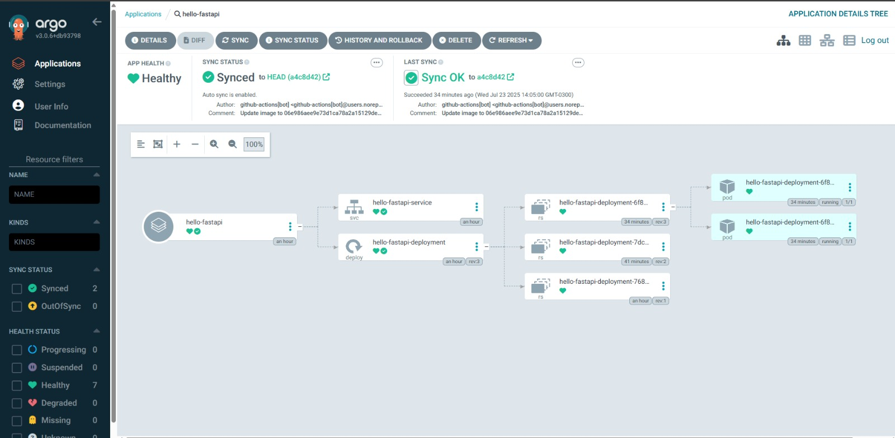
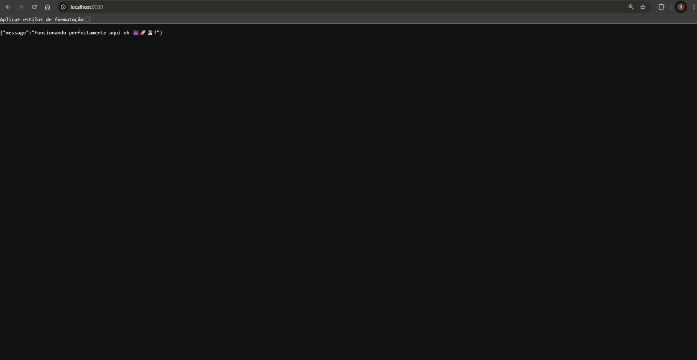

# 🚀 Projeto: Pipeline CI/CD para Aplicação FastAPI

<p align="center">
  
  
  
  
  
</p>

---

### 📖 Sobre o Projeto

Este projeto demonstra a criação de uma pipeline completa de **Integração Contínua e Entrega Contínua (CI/CD)** para uma aplicação web. O objetivo é automatizar todo o ciclo de vida do desenvolvimento: desde o `commit` do código até o `deploy` da aplicação em um ambiente Kubernetes.

O fluxo implementado segue as melhores práticas de **GitOps**, onde o repositório Git atua como a única fonte da verdade para o estado desejado da aplicação.

Este trabalho foi desenvolvido como parte do **Programa de Bolsas - DevSecOps da Compass UOL**.

---

### 🏛️ Arquitetura do Projeto

O projeto é composto por dois repositórios principais, seguindo o padrão GitOps de separação de responsabilidades:

1.  **`Compass-Ci-Cd` (Este Repositório):** Contém o código-fonte da aplicação FastAPI (`main.py`), a definição da imagem Docker (`Dockerfile`), e a definição do workflow de CI/CD do GitHub Actions (`.github/workflows/ci-cd.yml`).

2.  **`Compass-Ci-Cd-MANIFESTS`:** (Repositório separado: [https://github.com/BernardoMeucci/Compass-Ci-Cd-MANIFESTS](https://github.com/BernardoMeucci/Compass-Ci-Cd-MANIFESTS)) Contém os manifests do Kubernetes (`deployment.yaml` e `service.yaml`) que descrevem como a aplicação deve ser implantada no cluster.

---

### 🛠️ Tecnologias Utilizadas

* **Aplicação:**
    * `FastAPI`: Framework web Python para a construção da API.
* **Contêineres:**
    * `Docker`: Para empacotar a aplicação e suas dependências em uma imagem portátil.
    * `Docker Hub`: Como registry para armazenar as imagens Docker publicadas.
* **Automação (CI/CD):**
    * `GitHub Actions`: Para automatizar os processos de build e push da imagem Docker e a atualização dos manifestos de deploy.
* **Orquestração e Deploy (GitOps):**
    * `Kubernetes`: Plataforma de orquestração para executar a aplicação de forma escalável e resiliente em um cluster local.
    * `ArgoCD`: Ferramenta de GitOps que sincroniza o estado do cluster com os manifestos definidos no repositório Git.

---

### ✨ Fluxo da Automação

<details>
<summary><strong>Clique para ver o passo a passo detalhado do pipeline</strong></summary>
<br>

1.  **Gatilho Inicial: Commit do Desenvolvedor**
    - O ciclo é iniciado quando um `git push` é feito para o branch `main` do repositório da aplicação (`Compass-Ci-Cd`).

2.  **Etapa de CI: Execução do Workflow no GitHub Actions**
    - O `push` aciona o workflow definido em `.github/workflows/ci-cd.yml`.
    - O workflow executa dois jobs sequenciais:
        - **Job 1: `build-and-push`**:
            - Faz o checkout do código da aplicação.
            - Realiza o login no Docker Hub usando segredos (`secrets`).
            - Constrói a imagem Docker a partir do `Dockerfile`.
            - Envia a nova imagem para o Docker Hub com uma tag única baseada no hash do commit.
        - **Job 2: `update-manifest`**:
            - Faz o checkout do repositório de manifestos.
            - Utiliza o comando `sed` para substituir a tag da imagem no arquivo `deployment.yaml` pela nova tag gerada no passo anterior.
            - Realiza um novo `commit` e `push` para o repositório de manifestos, registrando a nova versão desejada da aplicação.

3.  **Etapa de CD: Sincronização com ArgoCD**
    - O ArgoCD, que monitora continuamente o repositório de manifestos, detecta o novo commit feito pelo GitHub Actions.
    - Ele compara o estado definido no Git com o estado atual do cluster e identifica uma divergência (status `OutOfSync`).
    - Como a política de sincronização é `Automatic`, o ArgoCD inicia imediatamente o processo para reconciliar o estado do cluster.

    <p align="center">
      
    </p>

4.  **Estado Final: Deploy no Kubernetes**
    - O ArgoCD instrui o Kubernetes a aplicar o manifesto atualizado.
    - O Kubernetes executa um "rolling update" no `Deployment` da aplicação, substituindo os pods antigos pelos novos com a nova imagem Docker, de forma gradual e sem indisponibilidade.
    - A nova versão da aplicação está no ar e pode ser acessada.

    <p align="center">
      
    </p>

</details>

---

### 🚀 Como Executar Localmente

Siga os passos abaixo para replicar o ambiente e o fluxo de CI/CD.

#### 1. 🏡 Preparação do Ambiente
   - **Clone os repositórios** da aplicação e dos manifestos.
   - **Garanta os pré-requisitos:** Docker Desktop com Kubernetes ativado e ArgoCD instalado no cluster.

#### 2. 🔑 Configuração do CI/CD
   - No repositório da aplicação no GitHub, vá em `Settings > Secrets and variables > Actions`.
   - Crie os três segredos necessários para a pipeline: `DOCKER_USERNAME`, `DOCKER_PASSWORD`, e `GH_PAT`.

#### 3. 🔄 Execução e Acesso
   - **Crie o App no ArgoCD**, apontando para o seu repositório de manifestos.
   - **Faça um `push`** no repositório da aplicação para iniciar o ciclo de automação.
   - Após a sincronização do ArgoCD, exponha o serviço com o comando:
     ```bash
     kubectl port-forward svc/hello-fastapi-service 8080:80
     ```
   - **Acesse o resultado final** no seu navegador:
     > `http://localhost:8080/`